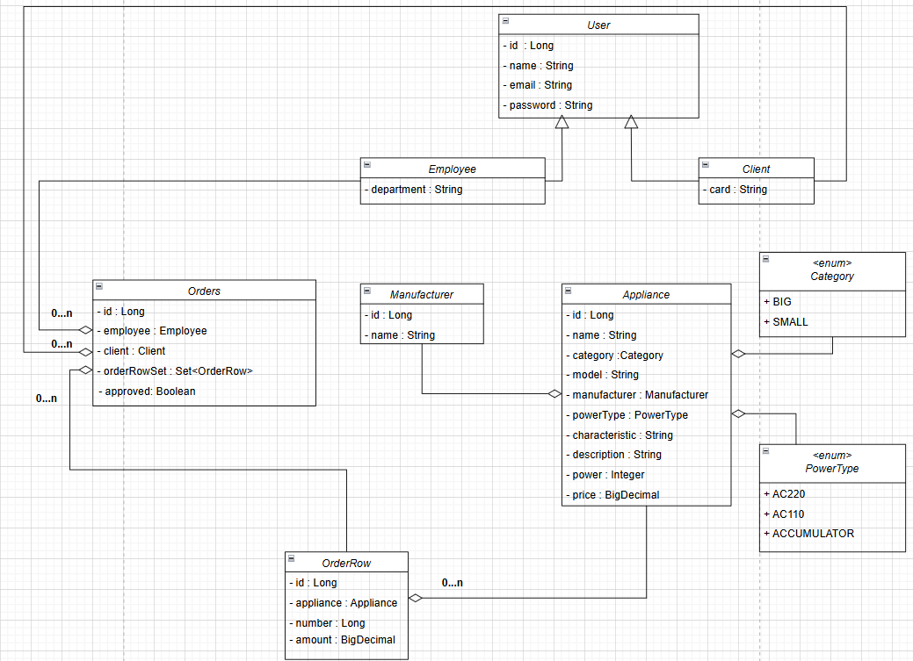

# Appliance store test(Spring Boot)

The purpose of this exercise is to check your knowledge and understanding Spring Boot technology.

Duration: **15** hour

## Description

In this exercise, you will implement an "Appliances shop" using Spring Boot.
Your application has to imitate work of an online shop.

Employees should be able to do the following:
1. show every table;
2. add, correct, and delete `Employee`, `Client`, `Appliance`, `Manufacturer`;
3. approve orders.

Clients and employees should be able to do the following:
1. have navigation and provide access for permitted elements front-end;
2. add, correct, and delete orders.

Users must be able to work in two languages(native and English). 

The class diagram of the Domain model is shown in the figure below:

Your application must implement next layers:
* Repository - work with necessary entities (JPA);
* Service - contains business logic your application;
* Controller - is front end your application. 

### Requirements:
* Use a skeleton application;
* Use H2 database to realisation storage;
* Use annotations to describe DB entities. List of entities:
  * `User`;
  * `Client`;
  * `Employee`;
  * `Manufacturer`;
  * `Appliance`;
  * `Order`;
  * `OrderRow`.
* Use Spring JPA technology;
* Use Spring Security;
* Implement internationalization and localization in controllers;
* Implement validation for the Domain model and controllers.

### Would be nice
* to use logging;
* to implement pagination and sorting in controllers;
* to explore other Spring technologies;
* to write tests for controllers and services.

### Recommendations
* Use `Lombok`
* Implement In-Memory Authentication(Spring Security).
* You have files with initial data, but you can use other data.
  To load initial data, use
  `spring.sql.init.data-locations=classpath:manufacturer.sql, classpath:client.sql, classpath:employee.sql, classpath:appliance.sql`
  in `application.properties`.
* Files with initial data located `resources`. The list of files includes `manufacturer.sql`, `client.sql`, `employee.sql`, `appliance.sql`.
* Additionally, you may to using files to frond-end from `resources\templates\**`, or use yourself front-end.  
* If you do not have enough time to implement all the requirements, you can choose to implement only part of the functionality. For example, you can focus on add, delete, and update for employees and not implement them for clients.

Good luck. You have only 15 hours